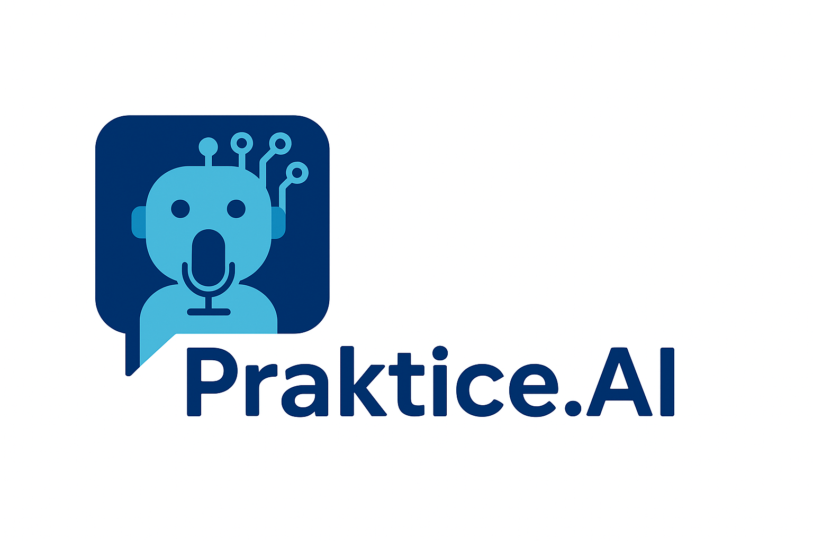

<div align="center">
  
  
  # 🚀 Praktice.AI
  
  ### *Your AI Superpower for Interview Success*
  
  [](https://prakticeai.vercel.app/)
  [](https://github.com/urstrulyPrateeK/Praktice.AI)
  [](LICENSE)
  [](https://reactjs.org/)
  [](https://www.typescriptlang.org/)
  
  **🎯 AI-Powered Mock Interview Platform | 🔥 250k+ Offers Received | ⭐ 1.2M+ Interviews Aced**
  
</div>

---

## 📋 Table of Contents

- [🌟 About](#-about)
- [✨ Features](#-features)
- [🖼️ Screenshots](#️-screenshots)
- [🚀 Live Demo](#-live-demo)
- [🛠️ Tech Stack](#️-tech-stack)
- [⚡ Quick Start](#-quick-start)
- [📦 Installation](#-installation)
- [🔧 Configuration](#-configuration)
- [📱 Usage](#-usage)
- [🤝 Contributing](#-contributing)
- [📄 License](#-license)
- [👨‍💻 Author](#-author)

---

## 🌟 About

**Praktice.AI** is a cutting-edge AI-powered mock interview platform designed to revolutionize how professionals prepare for job interviews. Using advanced artificial intelligence, real-time feedback, and personalized coaching, Praktice.AI helps candidates boost their confidence and increase their chances of landing their dream job.

### 🎯 Why Praktice.AI?

- **🤖 AI-Driven Insights**: Get real-time analysis of your responses, communication skills, and body language
- **📊 Personalized Feedback**: Receive tailored improvement suggestions based on your performance
- **🎯 Industry-Specific**: Practice with questions customized for your tech stack and experience level
- **📈 Progress Tracking**: Monitor your improvement over time with detailed analytics
- **🔒 Secure & Private**: Your data is protected with enterprise-grade security

---

## ✨ Features

<div align="center">

| 🎥 **AI Interview Coach** | 🎯 **Smart Question Generation** | 📊 **Real-time Analysis** |
|:-------------------------:|:--------------------------------:|:--------------------------:|
| Interactive AI-powered interviewer with natural conversation flow | Dynamic question generation based on job role, experience, and tech stack | Instant feedback on content quality, communication skills, and confidence |

| 🔐 **Secure Authentication** | 📱 **Responsive Design** | 🚀 **Performance Optimized** |
|:----------------------------:|:------------------------:|:-----------------------------:|
| Clerk-powered authentication with social login support | Beautiful glass morphism UI that works on all devices | Lightning-fast loading with optimized bundle sizes |

</div>

### 🔥 Core Capabilities

- ✅ **Custom Interview Generation** - Tailored questions for any role
- ✅ **Real-time Speech Recognition** - Practice speaking naturally
- ✅ **AI-Powered Feedback** - Get instant, actionable insights
- ✅ **Progress Tracking** - Monitor your improvement journey
- ✅ **Multiple Tech Stacks** - Support for all major technologies
- ✅ **Experience Levels** - From junior to senior positions
- ✅ **Performance Analytics** - Detailed breakdown of your sessions

---

## 🖼️ Screenshots

<div align="center">
  
  ### 🏠 Landing Page - Welcome to Praktice.AI
  
  
  *Beautiful hero section with glass morphism design and interactive elements showcasing the AI-powered interview platform*
  
  ---
  
  ### 🎯 Virtual Interview Room - Enter the Future
  
  
  *Immersive virtual interview environment where AI meets human potential*
  
  ---
  
  ### 🎥 Mock Interview Operation - AI in Action
  
  
  *Real-time AI analysis and feedback during live interview sessions with personalized coaching*
  
</div>

---

## 🚀 Live Demo

### 🌐 **[Try Praktice.AI Now!](https://prakticeai.vercel.app/)**

**🔥 Experience the future of interview preparation:**
- ✨ No installation required
- 🚀 Instant access to AI coaching
- 💯 Free to start practicing
- 🎯 Real-time feedback system

> **💡 Pro Tip:** Create an account to save your progress and unlock advanced features!

---

## 🛠️ Tech Stack

<div align="center">

### Frontend


### Backend & Database


### AI & Authentication


### Deployment & Tools


</div>

---

## ⚡ Quick Start

```bash
# 🚀 Get started in 3 simple steps!

# 1️⃣ Clone the repository
git clone https://github.com/urstrulyPrateeK/Praktice.AI.git

# 2️⃣ Navigate to the project
cd Praktice.AI

# 3️⃣ Install and run
pnpm install && pnpm dev
```

> **🌟 That's it!** Open [http://localhost:5173](http://localhost:5173) to see your local instance.

---

## 📦 Installation

### Prerequisites

Make sure you have the following installed:

- **Node.js** (v18.0.0 or higher) 📦
- **PNPM** (v8.0.0 or higher) ⚡
- **Git** (for cloning) 🔄

### Step-by-Step Installation

<details>
<summary>🔽 <strong>Click to expand detailed installation guide</strong></summary>

#### 1️⃣ Clone Repository
```bash
git clone https://github.com/urstrulyPrateeK/Praktice.AI.git
cd Praktice.AI
```

#### 2️⃣ Install Dependencies
```bash
# Using PNPM (recommended)
pnpm install

# Or using NPM
npm install

# Or using Yarn
yarn install
```

#### 3️⃣ Environment Setup
```bash
# Copy environment template
cp .env.example .env.local

# Edit environment variables
nano .env.local  # or use your preferred editor
```

#### 4️⃣ Start Development Server
```bash
pnpm dev
```

#### 5️⃣ Build for Production
```bash
pnpm build
pnpm preview
```

</details>

---

## 🔧 Configuration

### Environment Variables

Create a `.env.local` file in the root directory:

```bash
# 🔐 Authentication (Clerk)
VITE_CLERK_PUBLISHABLE_KEY=your_clerk_publishable_key

# 🔥 Firebase Configuration
VITE_FIREBASE_API_KEY=your_firebase_api_key
VITE_FIREBASE_AUTH_DOMAIN=your_project.firebaseapp.com
VITE_FIREBASE_PROJECT_ID=your_project_id
VITE_FIREBASE_STORAGE_BUCKET=your_project.appspot.com
VITE_FIREBASE_MESSAGING_SENDER_ID=your_sender_id
VITE_FIREBASE_APP_ID=your_app_id

# 🤖 AI Configuration (Google Gemini)
VITE_GEMINI_API_KEY=your_gemini_api_key
```

### 📚 Getting API Keys

<details>
<summary>🔑 <strong>How to get your API keys</strong></summary>

#### **Clerk Authentication**
1. Visit [clerk.com](https://clerk.com)
2. Create a new application
3. Copy the publishable key from the dashboard

#### **Firebase Setup**
1. Go to [Firebase Console](https://console.firebase.google.com)
2. Create a new project
3. Enable Firestore Database
4. Get configuration from Project Settings

#### **Google Gemini AI**
1. Visit [Google AI Studio](https://makersuite.google.com)
2. Create a new API key
3. Enable the Gemini API

</details>

---

## 📱 Usage

### 🎯 Creating Your First Mock Interview

1. **🔐 Sign Up/Login** - Use the authentication system
2. **📝 Fill Interview Details** - Job role, description, experience, tech stack
3. **🤖 AI Generation** - Let AI create personalized questions
4. **🎥 Start Interview** - Practice with real-time feedback
5. **📊 Review Results** - Analyze your performance and improve

### 🚀 Advanced Features

- **📈 Progress Tracking** - Monitor improvement over time
- **🎯 Custom Questions** - Add your own interview questions
- **📊 Analytics Dashboard** - Detailed performance insights
- **🔄 Multiple Sessions** - Practice as many times as you want

---

## 🤝 Contributing

We welcome contributions! Here's how you can help:

### 🌟 Ways to Contribute

- 🐛 **Bug Reports** - Found a bug? Let us know!
- ✨ **Feature Requests** - Have ideas? We'd love to hear them!
- 📖 **Documentation** - Help improve our docs
- 💻 **Code Contributions** - Submit PRs for features or fixes

### 📋 Contribution Process

1. **🍴 Fork** the repository
2. **🌿 Create** a feature branch (`git checkout -b feature/amazing-feature`)
3. **✅ Commit** your changes (`git commit -m 'Add amazing feature'`)
4. **🚀 Push** to the branch (`git push origin feature/amazing-feature`)
5. **📬 Open** a Pull Request

---

## 📄 License

This project is licensed under the **MIT License** - see the [LICENSE](LICENSE) file for details.

```
MIT License - Feel free to use this project for personal and commercial purposes!
```

---

## 👨‍💻 Author

<div align="center">
  
  ### **Prateek Kumar**
  
  [](https://github.com/urstrulyPrateeK)
  [](https://linktr.ee/urstrulyprateek)
  [](https://linktr.ee/urstrulyprateek)
  
  *"Building the future of AI-powered interview preparation"*
  
</div>

---

<div align="center">
  
  ## 🌟 Star History
  
  [](https://star-history.com/#urstrulyPrateeK/Praktice.AI&Date)
  
  ---
  
  ### 💖 **Thank you for checking out Praktice.AI!**
  
  **🚀 [Try it live](https://prakticeai.vercel.app/) | ⭐ [Star on GitHub](https://github.com/urstrulyPrateeK/Praktice.AI) | 🔄 [Share with friends](https://prakticeai.vercel.app/)**
  
  *Made with ❤️ and ☕ by [Prateek Singh](https://github.com/urstrulyPrateeK)*
  
</div>
